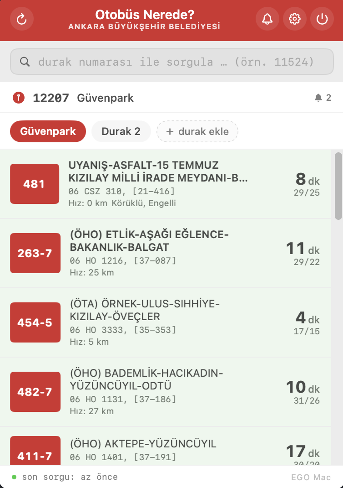

<p align="center">
  
</p>

<h1 align="center">EGO Mac</h1>

<p align="center">
  Native macOS menu bar app to track Ankara EGO buses, with EGO Cep'te–themed UI<br>
  and 5-minutes-before-arrival notifications. Built with Swift + AppKit/SwiftUI.
</p>

<p align="center">
  <a href="#"></a>
  <a href="#"></a>
  <a href="LICENSE"></a>
</p>

<p align="center">
  <em>Dock'ta yer kaplamayan, sağ üstte saatin yanında duran bir EGO Cep'te.</em><br>
  <em>Menü çubuğunda otobüsünün kaç dakika sonra geleceğini canlı görür,<br>
  eşik altına düşünce bildirim alırsın.</em>
</p>

<p align="center">
  
</p>

## Özellikler

- **Çoklu durak**: her durak kendi adı, numarası, izlenen hatlarıyla. Üstte pill-tab switcher.
- **Canlı sayım**: menü çubuğunda en yakın izlenen otobüsün ETA'sını gösterir, ` 4'`.
- **Hızlı sorgu**: popover'ın üstündeki search'e 5 haneli durak numarası yaz → kaydetmeden anlık sonuç. "Durak olarak kaydet" ile tek tıkla profile ekle.
- **Search**: durak adı (`kızılay`, `güvenpark`) veya hat (`481`, `balgat`) ile ara, listeden tıkla → otomatik dolar. 2943 OSM Ankara durağı bundle'da, 657 EGO otobüs hattı canlı.
- **Tap-to-expand**: bus satırına tıkla → plaka, araç ID, hız, durak konumu, aynı hattan diğer canlı otobüsler, bu duraktan yaklaşan kalkışlar.
- **Bildirim ayarı**: master toggle (header'da çan ikonu / Settings'te switch) — bildirimleri tek tıkla sustur, menü çubuğundaki countdown çalışmaya devam etsin.
- **Akıllı polling**: ETA ≤ 8 dk → 20 sn, ≤ 15 dk → 30 sn, aksi 90 sn. 23:00–06:00 sessiz saatler.
- **Dedup**: aynı plaka için bir kez bildirim.
- **EGO Cep'te tema**: kırmızı header, yeşil/pembe satır arkaplanları (yaklaşıyor / "Gidiyor"), kare kırmızı badge.
- **Açılışta otomatik başlama**: Login Items'a ekleyince Mac her açıldığında menü çubuğunda hazır.

## Kurulum

```bash
git clone https://github.com/byigitt/egomac.git
cd egomac
bash build.sh
cp -R "EGO Mac.app" /Applications/
open "/Applications/EGO Mac.app"
```

İlk açılışta:

- Gatekeeper uyarısı → **Sistem Ayarları → Gizlilik ve Güvenlik → "Yine de Aç"**
- Bildirim izni isterse **İzin Ver**

Login Items'a ekle: **Sistem Ayarları → Genel → Giriş Öğeleri ve Eklentiler → "+" → /Applications/EGO Mac.app**

### Kaynaktan geliştirme

```bash
swift build      # debug
swift run        # çalıştırırken (.app değil, sadece binary)
```

`.app` paketleme `build.sh` ile.

## Yapılandırma

Tüm ayarlar uygulama içinden — **⚙ ikonuna tıkla**. Diskte: `~/.ego-mac/config.json`.

- **Duraklar**: aç/kapa, ad, durak numarası (search ile), izlenen hatlar (chip ekle/sil)
- **Bildirim**: master toggle, test butonu, "Sistem Ayarları"na deep-link
- **Eşik**: 1–30 dk, slider + ± step
- **Sessiz saatler**: 24h picker
- **Çoklu durak**: "+ Yeni durak ekle"

## Mimari

```
Sources/EGOMac/
├── App.swift                NSStatusItem + NSPopover entry
├── Models.swift             Bus / Line / LineStop / LineSchedule / RouteSamplePoint / EGOConfig
├── EGOClient.swift          mblSrv14 JSON client + HareketSaatleri/HatListesi HTML scrapers
├── BusViewModel.swift       @MainActor; polling, dedup, alerts, ad-hoc lookup, schedule cache
├── RouteIndex.swift         Sample-based ordered stop list per line, persisted on disk
├── PassTimePredictor.swift  Heuristic ETA predictor (live anchor + schedule + observed segments)
├── PopoverView.swift        Navigation stack; bus list; tap-to-expand schedule; switcher
├── SearchView.swift         Cross-search (lines + stops) with Turkish-fold matching
├── LineDetailView.swift     Tabs: Otobüsler / Duraklar / Saatler / Harita
├── StopDetailView.swift     Read-only stop view with line jump + "durak kaydet"
├── LineMapView.swift        MapKit route map: numbered stops + polyline + heading-rotated buses
├── MapWindowController.swift Free-floating NSPanel host for the map view
├── SettingsView.swift       Crash-safe stops list, search, threshold, quiet hours
├── SearchIndex.swift        OSM stops + EGO line list (Turkish-fold fuzzy match)
├── StopsBlob.swift          Auto-generated; embedded OSM snapshot
├── Notifier.swift           UN + osascript fallback + NSAlert + DebugLog
├── Config.swift             ~/.ego-mac/config.json IO
└── VisualEffectView.swift   NSVisualEffectView SwiftUI bridge

docs/
└── api-discovery.md         Reverse-engineered EGO endpoints (live + dead)

scripts/
└── probe-ego.sh             Endpoint health check (run after EGO releases)
```

Detaylı geliştirici notları için → [`CONTRIBUTING.md`](CONTRIBUTING.md).

## Veri kaynakları

| Kaynak | Ne için |
| --- | --- |
| `GET egocptsrvand.ego.gov.tr/mblSrv14/service.asp?FNC=Otobusler&DURAK=N` | Bir durakta canlı + sonraki kalkışlar (JSON) |
| `GET egocptsrvand.ego.gov.tr/mblSrv14/service.asp?FNC=Otobus&HAT=X&DURAK=N` | Bir hattaki tüm canlı otobüsler + ETA (JSON) |
| `POST www.ego.gov.tr/AjaxData/HatListesi` | Hat katalogları — hat arama (HTML option) |
| `POST www.ego.gov.tr/HareketSaatleri` `hat_no1=X` | Hat saatleri + metadata (HTML, regex parse) |
| Embedded OSM snapshot (2 943 durak) | Stop name/number search + harita marker isimleri |

Detaylar: [`docs/api-discovery.md`](docs/api-discovery.md). Endpoint sağlık testi: `bash scripts/probe-ego.sh`.

Mobil app'in pcap'inden bulunan endpoint host'u `egocptsrvand.ego.gov.tr` (iPhone'da `pymobiledevice3 pcap --process Runner` ile doğrulandı). Eski IP-bazlı endpoint (`88.255.141.66/mblSrv*/service.asp`) artık 504. APK'da bulunan `/hibrit/action.asp` ailesi 200+0b dönüyor (drift watcher: `probe-ego.sh`).

## Yeni özellikler

- **Hat ve durak araması** (menü bar arama ikonu): Türkçe karakter normalizasyonlu fuzzy match — `kizilay`, `Kızılay`, `KIZILAY` aynı sonucu döner.
- **Hat detay**: Otobüsler / Duraklar / Saatler / Harita sekmeleri.
  - **Otobüsler**: hattaki her canlı otobüs, kullanıcının durağına ETA + plaka + doluluk.
  - **Duraklar**: sıralı durak listesi (canlı gözlemlerden öğrenilir), her durak için **tahmini geçiş saati** (HH:mm).
  - **Saatler**: Hafta içi / Cumartesi / Pazar tarifeleri (bugün vurgulu).
  - **Harita**: ayrı pencerede, numaralı durak marker'ları + canlı otobüs ikonları (heading rotasyonu) + 20 sn'lik canlı yenileme.
- **Tahmini geçiş saati**: üç katmanlı — (1) canlı otobüsten anchor, (2) gözlemsel segment ortalaması, (3) tarife süresi heuristici.

## Sorun giderme

**Menü ikonu 1 saniye görünüp kayboluyor** — Notch'lu MacBook'larda menü çubuğu doluysa ikon arka tarafa itilir. `⌘ + sürükle` ile sola çek.

**Bildirim gelmiyor** — Settings'te toggle açık mı kontrol et; "Test bildirim gönder" butonu ile dene; gelmezse "Bildirim izni kapalı" banner'ı çıkar, oradan Sistem Ayarları → Bildirimler'e tek tıkla.

**Desktop TCC izin penceresi** — `.app`'i Desktop'tan çalıştırırsan macOS dosya erişimi sorar. `/Applications`'a kopyala (Settings'te otomatik taşıma butonu var).

**Aynı otobüs için 2 bildirim** — EGO bazen vehicleId'yi rotate ediyor; dedup plate (kalıcı) anahtarına gore yapılıyor. Yine de olursa issue aç.

**Hat arama yavaş** — İlk arama 657 hattı çekerken bir kez ~1 sn sürer, sonrası anlık (in-memory cache).

## Yasal

Bu proje **resmi olmayan üçüncü taraf bir araçtır**. Ankara Büyükşehir Belediyesi veya EGO Genel Müdürlüğü ile bağlantısı yoktur, onaylı değildir. "EGO" ismi ve EGO Cep'te logosu sahiplerinin tescilli markalarıdır; burada yalnızca uygulamanın hangi toplu taşıma verisini kullandığını tanımlamak için (nominative fair use) yer almıştır.

Durak verisi OpenStreetMap (© OpenStreetMap contributors, ODbL).

Lisans: [MIT](LICENSE) — kişisel ve ticari kullanım serbest, garanti yok.

## Yazar

**Barış Cem Bayburtlu** — [@byigitt](https://github.com/byigitt)
